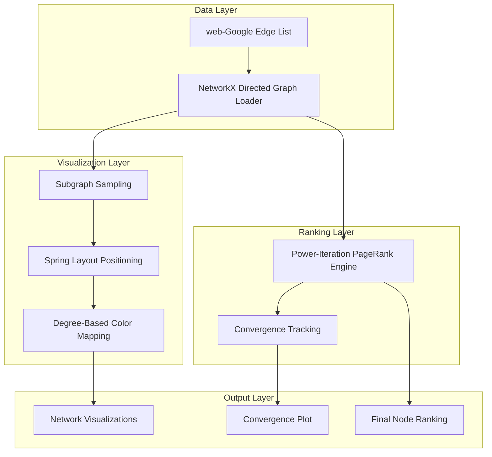
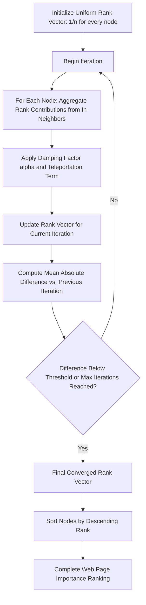

<div align="center">

</div>

---

# Large-Scale PageRank Analysis of the Google Web Graph

The project implements the PageRank algorithm from first principles and applies it to a real, large-scale hyperlink network released by Google, uncovering the most influential web pages through iterative power-method computation, convergence analysis, and network visualization.

<div align="left">

[](https://www.python.org/)
[](https://networkx.org/)
[](https://numpy.org/)
[](https://matplotlib.org/)
[](https://snap.stanford.edu/data/web-Google.html)
[](https://colab.research.google.com/)
[](#)
[](#)
[](https://opensource.org/licenses/MIT)

</div>

## Abstract

Ranking web pages by importance is a foundational problem in web-scale information retrieval, since a page's value depends not only on its content but on the structure of the hyperlink network surrounding it. This project builds a complete PageRank pipeline from scratch — without relying on any built-in ranking implementation — and evaluates it on the real-world `web-Google` hyperlink graph released by Google, containing over 875,000 web pages and more than 5.1 million directed hyperlinks. The pipeline visualizes the network structure through degree-weighted subgraph rendering, implements the power-iteration PageRank update rule with damping and teleportation, tracks convergence across iterations, and produces a fully ranked ordering of every node in the network by its computed importance score.

## Table of Contents

1. [Overview](#overview)
2. [Key Features](#key-features)
3. [System Architecture](#system-architecture)
4. [PageRank Computation Workflow](#pagerank-computation-workflow)
5. [Dataset](#dataset)
6. [Results and Analysis](#results-and-analysis)
7. [Project Structure](#project-structure)
8. [Usage and Installation](#usage-and-installation)
9. [License](#license)
10. [Author](#author)
11. [Support](#support)

# Overview

This project explores link analysis on a genuine, large-scale web graph rather than a synthetic toy network. Instead of calling an off-the-shelf ranking function, the PageRank algorithm is implemented directly as an iterative power method, giving full visibility into how rank mass propagates through the network at every step until the system converges to a stationary distribution.

The pipeline covers:

* Loading and representing a directed web-hyperlink graph with hundreds of thousands of nodes
* Visualizing network structure through degree-aware subgraph sampling, with and without node labels
* Implementing the PageRank power-iteration update rule with a configurable damping factor
* Tracking the mean rank difference between successive iterations to monitor convergence
* Producing a complete, sorted importance ranking over every node in the network

# Key Features

* From-scratch PageRank implementation using the power-iteration method
* Configurable damping factor, iteration cap, and convergence threshold
* Directed graph modeling of hyperlink structure with NetworkX
* Degree-weighted subgraph visualization with a perceptually scaled color map
* Convergence diagnostics via mean rank-difference tracking across iterations
* Full ranked ordering of nodes by computed PageRank score

---

# System Architecture

The pipeline follows a layered design in which the raw hyperlink graph is first transformed into a directed network representation, then simultaneously routed into a visualization branch and an iterative ranking-computation branch.



### Architectural Components

| Layer | Responsibility |
|:-------|:-----------------|
| Data Layer | Parsing the raw hyperlink edge list into an in-memory graph |
| Visualization Layer | Sampling, laying out, and rendering a readable subgraph of the network |
| Ranking Layer | Iteratively computing and updating PageRank scores until convergence |
| Output Layer | Rendered plots, convergence curves, and the final sorted ranking |

This separation keeps the ranking computation independent of how the network is visualized, allowing the same PageRank engine to run against the full graph while only a manageable subgraph is rendered for inspection.

# PageRank Computation Workflow



At each iteration, every node's rank is recomputed as a mixture of a small uniform teleportation probability and the damped sum of rank shares passed in from its in-neighbors, proportional to each neighbor's own out-degree. The mean absolute change in rank values across all nodes is recorded at every step, giving a direct, interpretable signal of how quickly the algorithm approaches its stationary distribution.

---

# Dataset

The analysis runs on the **web-Google** dataset from the Stanford Network Analysis Project (SNAP), a real hyperlink graph released by Google as part of the 2002 Google Programming Contest.

| Property | Value |
|:----------|:-------|
| Nodes (web pages) | 875,713 |
| Edges (hyperlinks) | 5,105,039 |
| Graph type | Directed |
| Source | [SNAP web-Google dataset](https://snap.stanford.edu/data/web-Google.html) |

Each node represents a web page and each directed edge represents a hyperlink from one page to another, making this dataset a faithful, large-scale testbed for evaluating link-analysis algorithms such as PageRank.

# Results and Analysis

The notebook produces three complementary views of the network:

* **Structural visualizations** — A sampled subgraph is rendered with a spring layout, both with and without node labels, where node color is scaled by degree using a perceptual power-law normalization to make high-degree hub pages visually distinguishable at a glance.
* **Convergence behavior** — The mean absolute difference in rank values between consecutive iterations is plotted, showing how the power-iteration method steadily contracts toward a stationary distribution as the number of iterations increases.
* **Final importance ranking** — Every node in the graph is sorted by its converged PageRank score, yielding a complete, quantitative ordering of web page importance across the entire 875K-node network.

Together, these outputs demonstrate that a simple, transparent power-iteration implementation is sufficient to extract meaningful, well-ordered importance signals from a real-world, million-edge hyperlink graph.

# Project Structure

```text
Large-Scale-PageRank-Analysis-of-the-Google-Web-Graph
│
├── pagerank_google_webgraph_analysis.ipynb
│
└── README.md
```

The graph edge list itself is not bundled in the repository; it is downloaded directly from the [SNAP web-Google dataset page](https://snap.stanford.edu/data/web-Google.html).

---

# Usage and Installation

```bash
# 1. Clone the repository
git clone https://github.com/ParmidaGh/Large-Scale-PageRank-Analysis-of-the-Google-Web-Graph.git
cd Large-Scale-PageRank-Analysis-of-the-Google-Web-Graph

# 2. Create and activate the environment
conda create -n pagerank-webgraph python=3.10
conda activate pagerank-webgraph

# 3. Install the core dependencies
pip install networkx matplotlib numpy
```

### Reproducibility

Download the `web-Google.txt.gz` edge list from the [SNAP web-Google dataset page](https://snap.stanford.edu/data/web-Google.html), update the file path in the loading cell to point to it, then run the notebook cells sequentially. A standard CPU environment is sufficient, though a machine with a few gigabytes of free memory is recommended given the size of the full graph.

---

# License

This project is licensed under the MIT License.

---

## Author

**Parmida Ghamari**
M.Sc. Student, University of Tehran
Research Assistant @ Social Networks Lab

**Research Interests:** Network Science, Graph Mining, Link Analysis and Ranking Algorithms, Large-Scale Network Data, Natural Language Processing (NLP), Large Language Models (LLMs), Agentic AI, Retrieval-Augmented Generation (RAG)

📧 [Parmida.ghamari@gmail.com](mailto:Parmida.ghamari@gmail.com) | 💻 [github.com/ParmidaGh](https://github.com/ParmidaGh) | 💼 [linkedin.com/in/parmida-ghamari](https://www.linkedin.com/in/parmida-ghamari)

---

# Support

If you find this project useful, consider giving it a star ⭐

---

<p align="center">
Built using NetworkX, Matplotlib, and NumPy
</p>
